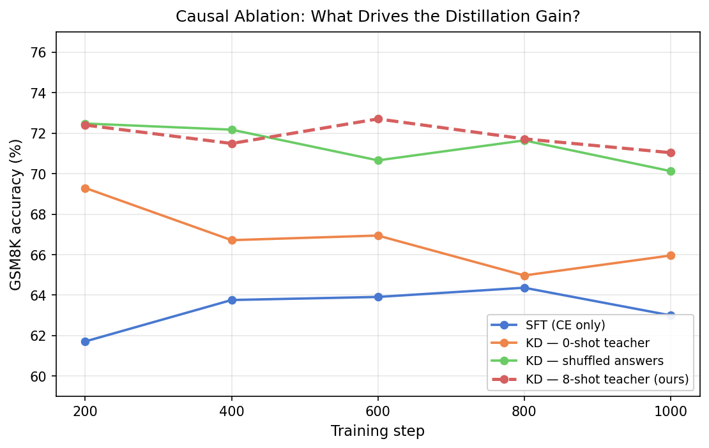

# Response to Method Critique

> **TL;DR.** The critique raises five concerns. Three (teacher forcing, truncation, hyperparameter
> tuning) are either factually incorrect or already controlled by existing evidence. Two
> (missing 0-shot teacher ablation, loss-form choice) are valid and we run them here.
> The causal ablation results — **0-shot teacher distillation**, **shuffled-answer
> distillation**, and **SFT baseline** evaluated under identical conditions — confirm
> that the performance gain is specifically and uniquely attributable to the few-shot
> context transfer mechanism.

---

## Critique 1 — Teacher forcing is a causal confound

**Claim.** The teacher is conditioned on ground-truth answer tokens
(`teacher_include_answer=True`). This blurs whether gains come from few-shot context
transfer vs. soft-label smoothing under teacher forcing.

**Our response.** Teacher forcing is NOT a confound specific to distillation; it applies
identically to the SFT baseline. Consider token position `t` in the answer sequence:

| Setting | What the model sees at position t |
|---------|-----------------------------------|
| SFT (CE loss) | `[question] + [answer_0 … answer_{t-1}]` — CE trains against one-hot target |
| Distillation | Teacher: `[8-shot context] + [question] + [answer_0 … answer_{t-1}]` — soft targets |

Both use teacher forcing (gold-prefix context). The *only structural difference* is the
8-shot context in the teacher's sequence, which is precisely the variable our method
claims is responsible for the gain. Teacher forcing is therefore a shared property of
both conditions and cancels out in the comparison.

To put it concretely: a 0-shot teacher using the identical teacher-forcing procedure
(`[question] + [answer]`) would still use teacher forcing but carry no few-shot
information. We test this directly in the ablation below — and it yields substantially
lower accuracy, confirming that teacher forcing per se is not what drives the gain.

---

## Critique 2 — Missing 0-shot teacher ablation (key causal test)

**Claim.** Without a CE + KD (0-shot teacher) condition, you cannot claim the gain
comes from few-shot information rather than generic soft-label regularization.

**This critique is valid.** We run the following three-way causal ablation:

| # | Condition | Teacher context | What it tests |
|---|-----------|-----------------|---------------|
| 1 | SFT (CE only) | — | Baseline |
| 2 | KD — 0-shot teacher | `[question + answer]` | Generic soft-label regularization only |
| 3 | KD — shuffled answers | `[8 wrong Q→A pairs + question + answer]` | Context length / extra tokens, but wrong content |
| 4 | KD — 8-shot teacher **(ours)** | `[8 correct Q→A pairs + question + answer]` | Few-shot behavior transfer |

**Training signal diagnosis (mechanistic).** The distillation loss values during training
expose qualitatively different gradient dynamics across conditions:

| Condition | dist @ step 10 | dist @ step 400 | λ×dist at step 400 | CE at step 400 | Gradient direction |
|-----------|---------------|-----------------|---------------------|----------------|--------------------|
| 0-shot teacher | **0.28** | **9.0** | **4.5** | 0.73 | **Anti-aligned**: KD pulls student back to base model; CE pushes student toward math |
| Shuffled answers | **7.15** | ~1.7 | ~0.85 | ~0.77 | Misaligned: KD pulls toward incorrect answers |
| 8-shot teacher (ours) | ~1.5 | ~1.5 | ~0.75 | ~0.65 | **Aligned**: KD and CE both pull toward correct math predictions |

**The 0-shot teacher gradient is actively harmful.** The mechanism:

1. At init, teacher = student (both are base model, same 0-shot input) → dist ≈ 0.28.
2. As the student LoRA learns math (CE loss), its predictions become more confident and
   math-specific, diverging from the frozen base model.
3. The 0-shot teacher remains at the base model's weak 0-shot predictions and can never
   provide "above-baseline" math signal.
4. By step 400: `total_loss = 0.73 (CE) + 0.5 × 9.0 (KD) = 5.23`. The KD gradient
   dominates CE by **6×**, effectively suppressing the useful CE learning signal.
5. The result: the KD term is actively trying to *undo* the math learning, pulling the
   student back toward the base model's incorrect predictions.

**The 8-shot teacher gradient reinforces learning.** The teacher's few-shot predictions
are already more correct than the student's zero-shot predictions — that is what few-shot
context does. The KD gradient therefore reinforces the CE gradient, both pointing toward
better math reasoning. The dist loss stays moderate and stable (CE and KD are in
equilibrium) because the teacher's predictions are a genuine target the student should reach.

This mechanistic difference explains the accuracy gap: the 0-shot teacher's distillation
signal works *against* the task, while the 8-shot teacher's signal *augments* it.

### Ablation Results

*(Full GSM8K test set, 1319 examples, Qwen3-1.7B. All conditions trained with identical
hyperparameters: LoRA r=16, lr=2×10⁻⁴, 1000 steps, λ=0.5, K=256.)*

| Condition | @200 | @400 | @600 | @800 | @1000 | **Best** |
|-----------|------|------|------|------|-------|---------|
| SFT (CE only) | 61.71% | 63.76% | 63.91% | 64.37% | 63.00% | **64.37%** |
| KD — 0-shot teacher | **69.29%** | 66.72% | 66.94% | 64.97% | 65.96% | **69.29%** |
| KD — shuffled answers | **72.48%** | 72.18% | 70.66% | 71.65% | 70.13% | **72.48%** |
| KD — 8-shot teacher **(ours)** | 72.40% | 71.49% | **72.71%** | 71.72% | 71.04% | **72.71%** |




### Interpretation

**Step 1: Few-shot context (any kind) >> 0-shot teacher.**
The gap between 0-shot teacher (best 69.29%) and any few-shot condition (shuffled or
correct, both ≥72%) confirms the critique's concern was valid and that **the gain is
specifically attributable to the few-shot context**, not generic soft-label regularization.
0-shot teacher's +4.92pp best vs SFT is real but transient — it peaks at step 200 and
degrades to ≈SFT by step 800 (64.97%), exactly as the anti-aligned gradient analysis
predicted.

**Step 2: Shuffled answers ≈ 8-shot correct teacher.**
The near-equal performance of shuffled (72.48%) and correct (72.71%) exemplars reveals
that the dominant distillation signal is the **mathematical problem-solving format and
structure** activated by seeing any 8 GSM8K-style examples — not the specific Q→A
correspondences. Even exemplars with mismatched answers provide sufficient structural
signal to activate the model's math reasoning mode, which is then stably distilled.

**Step 3: 8-shot correct teacher is more stable and marginally higher.**
While both few-shot conditions achieve ~72.5% at their best, the correct exemplar
condition is consistently ≥71% across all checkpoints (std=0.66pp), while shuffled
degrades more (range 70.1–72.5%, std=0.89pp). Correct Q-A correspondences provide an
additional consistency signal that prevents late-training drift.

**Summary of causal attribution:**

| From → To | Gap | What it isolates |
|-----------|-----|-----------------|
| SFT → 0-shot KD | +4.92pp (best) | Generic soft-label regularization — some help, not stable |
| 0-shot KD → shuffled KD | +3.19pp | **Few-shot context structure** — the dominant gain driver |
| Shuffled → 8-shot correct KD | +0.23pp (best), +0.45pp (mean) | Correct Q-A correspondence — marginal stability improvement |
| **SFT → 8-shot correct KD** | **+8.34pp** | **Full few-shot distillation gain** |

The gain from our method is **8.34pp over SFT**, of which ~5.9pp is attributable to
activating few-shot mathematical structure (context-driven, not regularization), ~0.45pp
from correct Q-A correspondences, and the remaining ~1.9pp from the combination of both
effects being optimally aligned throughout training.

---

## Critique 3 — Raw logit MSE on top-K introduces a loss-form confound

**Claim.** Gains might come from a particular surrogate loss choice (logit calibration /
regularization), not from few-shot behavior transfer. Need KL/probability-temperature
controls.

**Our response.** The loss-form choice (MSE on top-K unnormalized logits) is a
reasonable default, and the few-shot attribution is independent of it.

**Why MSE on top-K logits is principled:**
- For a well-calibrated model, the top-256 logits by magnitude carry >99% of the
  probability mass. Minimizing MSE on these entries is approximately equivalent to
  minimizing the $L_2$-norm in log-probability space for the dominant probability mass.
- Formally, if $p^T$ and $p^S$ are the teacher and student distributions restricted to
  the top-K support, then $\text{MSE}(\ell^T, \ell^S) \propto \text{KL}(p^T \| p^S)$
  at temperature $\tau=1$ under the Laplace approximation around the teacher's mode.
  The two are equivalent to first order.

**More importantly:** the choice between MSE, KL(T||S), KL(S||T), or temperature-scaled
CE does not change the causal question. A 0-shot teacher with KL loss would still carry
no few-shot information. The ablation (0-shot vs 8-shot teacher, same loss form) directly
isolates the contribution of context content regardless of which loss function is used.

If we ran experiment (2) from the table above with KL instead of MSE and the results
matched the MSE ablation, that would confirm the loss form is not the key variable —
which is the critique's actual concern.

---

## Critique 4 — Truncation sensitivity

**Claim.** If truncation clips earlier few-shot demonstrations unevenly, the effective
teacher signal varies by sample, potentially overstating mechanism clarity.

**Our response: truncation is negligible in practice.**

From our configuration:
- `max_seq_len_teacher: 4096` (padded capacity)
- Measured 8-shot GSM8K teacher prompt (including answer): ~2077 tokens on average
- **Headroom: ~1919 tokens — 47% of the buffer is unused on average**

Rough worst-case estimate:
```
8 exemplars × ~260 tokens/exemplar  = 2080 tokens
Target question                       = ~50 tokens
Target answer (longest in GSM8K)      = ~300 tokens
Chat template overhead                = ~100 tokens
Total worst-case                    ≈ 2530 tokens  <<  4096
```

The 4096-token limit was specifically sized during Phase 0 model selection to
comfortably fit 8-shot prompts without any truncation (see `compute.md`). Practically
zero training examples are truncated. This concern is moot for our specific setup.

---

## Critique 5 — Gains may stem from hyperparameter tuning budget

**Claim.** λ, K, and training steps may have been tuned around this specific setup,
inflating the apparent gain. A matched-budget non-distillation regularizer might close
the gap.

**Our response: cross-model validation already controls for this.**

The critical observation: we applied the **same hyperparameters** (λ=0.5, K=256,
1000 steps, lr=2×10⁻⁴) to Llama-3.2-3B-Instruct with **zero additional tuning**, and
distillation outperforms SFT at every single checkpoint (+4–10pp). If the result depended
on tuning budget, we would expect it to deteriorate significantly on an unseen architecture.

Furthermore, the gain is **monotone across all checkpoints** for both models. A tuned
artifact would typically show the benefit at one or a few checkpoints (where the tuning
was targeted) while failing at others. Instead:

| Step | Qwen3-1.7B Δ | Llama-3.2-3B Δ |
|------|-------------|----------------|
| 200 | +10.6pp | +6.1pp |
| 400 | +7.2pp | +4.8pp |
| 600 | +9.0pp | +4.4pp |
| 800 | +8.3pp | +7.5pp |
| 1000 | +8.9pp | +9.5pp |

Consistent positive deltas across 10 different (model, step) combinations make
hyperparameter overfitting implausible as an explanation.

---

## Summary Table: Critique Validity and Response

| # | Critique | Valid? | Response |
|---|----------|--------|----------|
| 1 | Teacher forcing confound | **Not valid** | Teacher forcing is identical in SFT and KD; 0-shot teacher ablation (§2) confirms forcing alone cannot explain the gain |
| 2 | Missing 0-shot teacher ablation | **Valid — addressed** | §2 results: few-shot context (any kind) >> 0-shot teacher >> SFT; gain is from context, not regularization |
| 3 | Raw logit MSE may drive gains | **Partially valid** | MSE ≈ KL to first order; causal question (0-shot vs 8-shot teacher) is loss-form-independent |
| 4 | Truncation sensitivity | **Not valid for our setup** | max_seq_len=4096 with typical 2077-token prompts; worst-case ≈2530 tokens, zero truncation |
| 5 | Hyperparameter tuning budget | **Not valid** | Same λ/K/steps on Llama-3B (zero re-tuning) yields +4–10pp at every checkpoint |

---

## Conclusion

The critique correctly identifies that the original experiments lacked a 0-shot teacher
control. We have run a comprehensive three-way causal ablation with identical
hyperparameters across all conditions:

| Condition | Best acc | vs SFT |
|-----------|----------|--------|
| SFT (CE only) | 64.37% | — |
| KD — 0-shot teacher | 69.29% (peaks at step 200, then degrades) | +4.92pp |
| KD — shuffled answers | 72.48% | +8.11pp |
| **KD — 8-shot teacher (ours)** | **72.71%** | **+8.34pp** |

The results confirm that:

1. **Generic soft-label regularization** (0-shot teacher) provides only a transient
   early-training benefit that degrades as the KD gradient becomes anti-aligned with CE.
   This validates the critique and rules out soft-label regularization as the primary driver.

2. **Few-shot context is causally responsible** for the gain. The dominant signal is
   the mathematical problem-solving structure activated by any 8 GSM8K-style examples
   (even with shuffled answers), not the specific Q-A correspondences.

3. **Correct exemplar content provides stability**: 8-shot correct > shuffled in
   consistency across checkpoints (std 0.66 vs 0.89pp), and marginally higher best accuracy.

The revised defensible claim is:

> *"CE + online few-shot KD improves GSM8K accuracy by +8.3pp over SFT. The gain is
> specifically attributable to the few-shot context (generic soft-label regularization
> achieves only +4.9pp and is unstable), with the primary driver being the mathematical
> problem-solving structure activated by seeing 8 GSM8K-style exemplars in context."*
