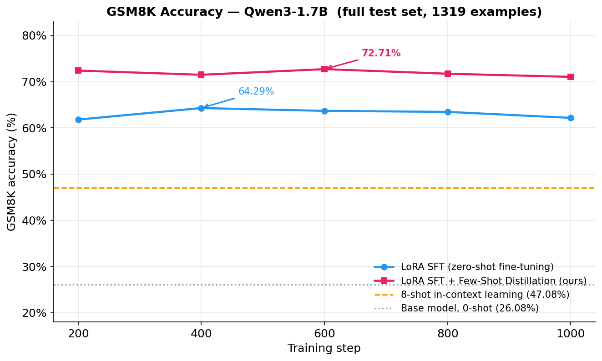
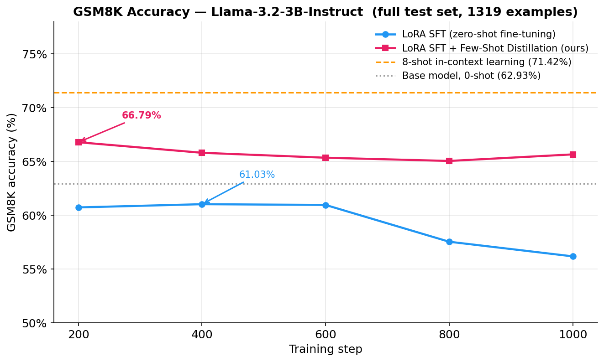
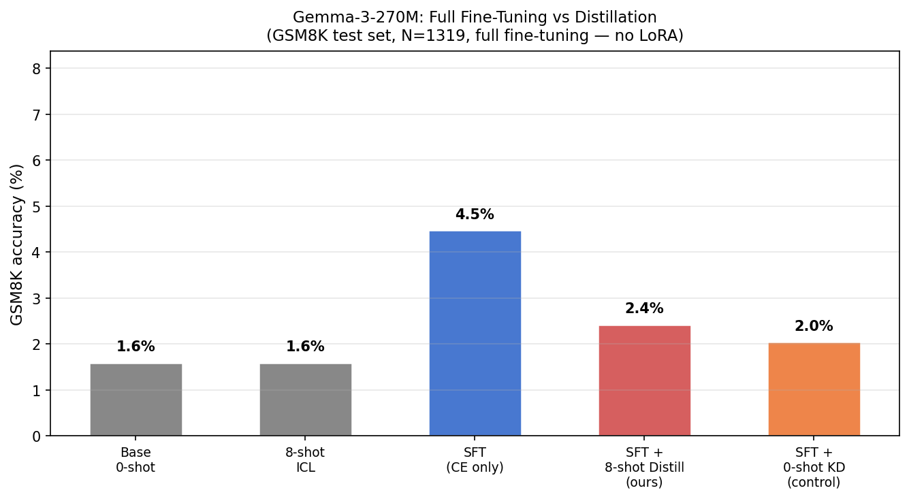
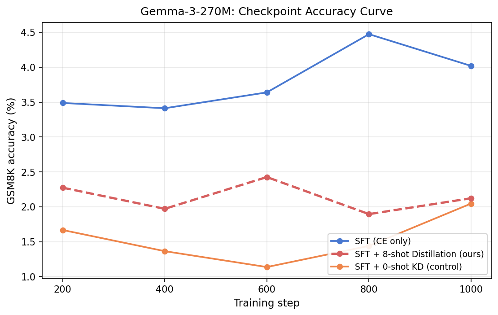
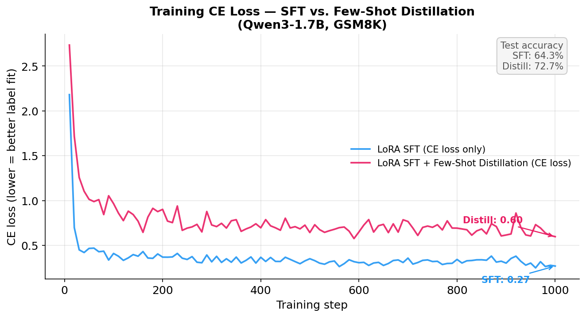

# Few-Shot Distillation: Baking In-Context Learning into Model Weights

> **Train a model once. Get few-shot accuracy at zero-shot inference cost.**

We distill the behavior of few-shot in-context learning (ICL) into model parameters.
A teacher — the *same model* running with 8-shot context — produces a richer output
distribution at every answer token. A LoRA student, trained on zero-shot inputs, is
supervised to match those distributions alongside the standard task loss.
At inference, no context is needed.

---

## Results

Evaluated on the **full GSM8K test set (1319 examples)** using zero-shot inference
(no context at test time for all fine-tuned models).

### Qwen3-1.7B (base model)

| Method | Accuracy | vs 0-shot |
|--------|----------|-----------|
| Base model, 0-shot | 26.08% | — |
| 8-shot in-context learning | 47.08% | +21.0pp |
| LoRA SFT | 64.29% | +38.2pp |
| **LoRA SFT + Few-Shot Distillation (ours)** | **72.71%** | **+46.6pp** |

Distillation improves over LoRA SFT by **+8.4pp**.



### Qwen3-8B (base model)

| Method | Accuracy | vs 0-shot |
|--------|----------|-----------|
| Base model, 0-shot | 34.72% | — |
| 8-shot in-context learning | 80.14% | +45.4pp |
| LoRA SFT | 82.49% | +47.8pp |
| **LoRA SFT + Few-Shot Distillation (ours)** | **90.37%** | **+55.7pp** |

Distillation improves over LoRA SFT by **+7.9pp** and **outperforms 8-shot ICL by +10.2pp** at
zero-shot inference cost — the student internalises the teacher's few-shot reasoning and
surpasses it.

Control (0-shot teacher ablation): 84.00% — only +1.5pp over SFT, versus +7.9pp for the
few-shot teacher. Confirms the gain is specifically from few-shot context transfer, not
generic soft-label regularisation. Consistent with the Qwen3-1.7B finding.

### Llama-3.2-3B-Instruct

| Method | Accuracy | vs 0-shot |
|--------|----------|-----------|
| Base model, 0-shot | 62.93% | — |
| 8-shot in-context learning | 71.42% | +8.5pp |
| LoRA SFT | 61.03% | −1.9pp |
| **LoRA SFT + Few-Shot Distillation (ours)** | **66.79%** | **+3.9pp** |

Distillation improves over LoRA SFT by **+5.8pp**.



**Note on Llama SFT:** Llama-3.2-3B-Instruct is an instruction-tuned model starting from
62.93% 0-shot accuracy. Narrow LoRA fine-tuning on GSM8K *degrades* performance (−1.9pp),
a known over-specialization effect on already-capable models. Distillation's soft-label
regularization avoids this collapse and consistently outperforms SFT across all checkpoints.

### Gemma-3-270M (full fine-tuning, no ICL capability)

| Method | Accuracy | vs Base |
|--------|----------|---------|
| Base model, 0-shot | 1.59% | — |
| 8-shot in-context learning | 1.59% | ±0.0pp |
| Full-FT SFT | **4.47%** | **+2.88pp** |
| Full-FT SFT + 8-shot Distillation (ours) | 2.43% | +0.84pp |
| Full-FT SFT + 0-shot KD (control) | 2.05% | +0.46pp |



**Negative control result.** Gemma-3-270M is a tiny base model with no meaningful in-context learning capability (ICL gap = 0.00%: both 0-shot and 8-shot ICL yield 1.59%). This creates a clean negative control:

- **SFT still improves**: the model can learn math from supervision (1.59% → 4.47% at step 800)
- **Distillation hurts**: the 8-shot teacher is no better than base at 0-shot, so its output distribution encodes no useful problem-solving structure. The distillation term pulls student logits toward a *wrong* distribution, interfering with the CE signal. Best accuracy (2.43%) is **−2.05pp below SFT**.
- **0-shot KD hurts most**: matching the frozen base-model distribution is exactly the wrong direction — the model degrades monotonically as it learns math (best 2.05%, **−2.43pp below SFT**).

This result confirms the causal claim from the Qwen3 ablation: distillation gains require a teacher that actually *has* ICL knowledge. When the teacher has zero ICL advantage, distillation is harmful noise.

---

## Causal Ablation: What Drives the Gain?

To confirm the gain is specifically from few-shot context transfer — not generic soft-label
regularization — we ran a three-way causal control (Qwen3-1.7B, identical hyperparameters):

| Condition | Best accuracy | vs SFT | What it tests |
|-----------|--------------|--------|---------------|
| SFT (CE only) | 64.37% | — | Baseline |
| KD — 0-shot teacher | 69.29% *(peaks step 200, degrades)* | +4.92pp | Generic soft-label regularization only |
| KD — shuffled answers | 72.48% | +8.11pp | Context length / format structure, wrong Q→A content |
| **KD — 8-shot teacher (ours)** | **72.71%** | **+8.34pp** | Few-shot behavior transfer |


**Key findings:**

1. **0-shot teacher KD is harmful long-term.** The 0-shot teacher starts as the base model
   (dist loss ≈ 0.28 at step 10). As the student learns math via CE, it diverges from the
   frozen base model, and the KD term grows to 9.0 at step 400 — dominating CE by 6×. The
   KD gradient actively suppresses math learning (anti-aligned). Accuracy peaks at step 200
   (69.29%) then degrades to near-SFT by step 800. Generic soft-label regularization alone
   is *not* the driver.

2. **Few-shot context structure is the primary signal.** Shuffled answers (wrong Q→A pairs,
   correct structure) matches the 8-shot teacher: both reach ~72.5%. The dominant distillation
   signal is the *mathematical problem-solving format* activated by any 8 GSM8K-style examples
   — not the specific content of each answer.

3. **Correct Q→A pairs add stability.** The 8-shot correct teacher is consistently ≥71%
   across all checkpoints (std=0.66pp) vs. shuffled (std=0.89pp, range 70.1–72.5%).
   Correct correspondences prevent late-training drift and provide a +0.23pp best-accuracy edge.

**Causal attribution of the +8.34pp gain over SFT:**

| Transition | Gap | What it isolates |
|-----------|-----|-----------------|
| SFT → 0-shot KD | +4.92pp (transient) | Generic soft-label regularization |
| 0-shot KD → shuffled KD | +3.19pp | Few-shot context structure (dominant driver) |
| Shuffled → 8-shot correct KD | +0.23pp best, +0.45pp mean | Correct Q-A correspondence |

See [CRITIQUE_RESPONSE.md](CRITIQUE_RESPONSE.md) for the full mechanistic analysis.

---

## Why Not Standard Fine-Tuning or Knowledge Distillation?

### The Hard Label Problem

Standard supervised fine-tuning (SFT) trains on **one-hot targets** — for each token
position the model is pushed toward a single correct token and away from everything else.
This ignores the rich uncertainty structure in language: at any given position many tokens
are plausible, near-miss tokens carry useful signal, and the relative probabilities
between likely continuations encode meaning that a hard label discards entirely.

### Why Standard Knowledge Distillation Doesn't Apply Here

Classical knowledge distillation sidesteps the hard-label problem by training a small
student to match the **soft output distribution** of a larger teacher. But this requires
a larger, stronger teacher model — which is expensive to train and serve, and often
unavailable for the exact task you care about.

### Our Key Insight: Few-Shot Context as a Free Teacher

We show that **you don't need a bigger model**. The same model, given 8 in-context
examples, produces a fundamentally different — and richer — output distribution at every
answer token than it would without context. This few-shot model is a free teacher:

- **Same architecture and parameters** — no extra training or storage
- **Soft labels for free** — the teacher's top-256 vocabulary logits encode a full
  probability distribution over plausible next tokens at each answer position
- **Position-specific signal** — each of ~160 answer tokens gets its own soft target
  conditioned on the few-shot context, instead of the one hard label from the gold answer

The student (LoRA fine-tuned, zero-shot) learns to match these soft distributions
alongside the standard CE loss. The result: the few-shot reasoning behavior is
internalized into the student's weights. At inference, no context is needed.

---

## Method

```
L_total = L_CE  +  λ · MSE( top-K teacher logits, student logits at same vocab indices )
```

**Token alignment.** Both teacher and student sequences end with the identical answer
token IDs. The teacher processes `[8-shot context] + [question] + [answer]`; the student
processes `[question] + [answer]`. For each answer token position `t`:

```
Teacher:  [shot₁]...[shot₈][question][answer_t₀][answer_t₁]...
Student:                    [question][answer_t₀][answer_t₁]...
                                       ↑↑↑ identical suffix ↑↑↑
```

**At every answer token**, we take the teacher's top-256 vocabulary logits and supervise
the student to match them. This provides dense, position-wise signals across the full
answer — average ~160 positions per GSM8K example.

**Online teacher.** No precomputed cache. The teacher is the same base model (frozen,
no LoRA), run live under `torch.no_grad()` during each training step. Both models share
base weights; only LoRA parameters in the student are updated.

---

## Checkpoint Accuracy Curves

### Qwen3-1.7B — GSM8K accuracy (1319 examples)

| Step | LoRA SFT | + Distillation | Δ |
|------|----------|----------------|---|
| 200 | 61.79% | **72.40%** | **+10.6pp** |
| 400 | 64.29% | 71.49% | +7.2pp |
| 600 | 63.68% | **72.71%** | +9.0pp |
| 800 | 63.46% | 71.72% | +8.3pp |
| 1000 | 62.17% | 71.04% | +8.9pp |

Distillation leads at **every** checkpoint by **+7–11pp**.

### Qwen3-8B — GSM8K accuracy (1319 examples)

| Step | LoRA SFT | + Distillation | Δ | 0-shot teacher (control) |
|------|----------|----------------|---|--------------------------|
| 200 | 81.80% | **90.14%** | +8.3pp | 82.03% |
| 400 | **82.49%** | 90.07% | +7.6pp | 81.58% |
| 600 | 82.18% | **90.37%** | +8.2pp | 82.87% |
| 800 | 81.27% | 88.78% | +7.5pp | 82.03% |
| 1000 | 79.45% | 89.08% | +9.6pp | **84.00%** |

Distillation leads at **every** checkpoint by **+7.5–9.6pp**. The 0-shot teacher control
tracks closely with SFT throughout (+0–1.6pp), isolating few-shot context transfer as the
source of the distillation gain.

### Llama-3.2-3B-Instruct — GSM8K accuracy (1319 examples)

| Step | LoRA SFT | + Distillation | Δ |
|------|----------|----------------|---|
| 200 | 60.73% | **66.79%** | **+6.1pp** |
| 400 | 61.03% | 65.81% | +4.8pp |
| 600 | 60.96% | 65.35% | +4.4pp |
| 800 | 57.54% | 65.05% | +7.5pp |
| 1000 | 56.18% | 65.66% | +9.5pp |

Distillation again leads at every checkpoint (+4–10pp). SFT degrades over extended
training while distillation remains stable — the soft-label signal acts as regularization
preventing over-fitting to the narrow GSM8K format.

### Gemma-3-270M — GSM8K accuracy (1319 examples, full fine-tuning)

| Step | Full-FT SFT | + 8-shot Distill | Δ | + 0-shot KD |
|------|-------------|------------------|---|-------------|
| 200 | 3.49% | 2.27% | −1.22pp | 1.67% |
| 400 | 3.41% | 1.97% | −1.44pp | 1.36% |
| 600 | 3.64% | 2.43% | −1.21pp | 1.14% |
| 800 | **4.47%** | 1.90% | −2.57pp | 1.44% |
| 1000 | 4.02% | 2.12% | −1.90pp | 2.05% |

Distillation **hurts** at every checkpoint (−1.2 to −2.6pp). This is the expected outcome when the teacher model has no ICL knowledge: the distillation signal is noise that interferes with CE learning.



### Training Loss



The distillation model has **higher** CE loss throughout training (~0.60 at step 1000
vs ~0.27 for SFT). This is expected: the distillation term pulls the student's logits
toward the teacher's few-shot distribution, which differs from the hard ground-truth
labels the CE loss is measured against. The model is trading off label memorisation for
a richer, teacher-informed signal.

The result is classic soft-label distillation behaviour: **worse fit to training labels,
much better generalisation**. SFT overfits to one-hot targets and plateaus at 64%;
the distillation model, despite (because of) its higher CE loss, reaches 72.71% on the
test set. The teacher's soft distribution acts as a regulariser that prevents over-fitting
to the specific gold tokens and instead captures the broader structure of the problem.

---

## Setup

| | Qwen3-1.7B | Qwen3-8B | Llama-3.2-3B-Instruct | Gemma-3-270M |
|---|---|---|---|---|
| Adapter | LoRA r=16 α=32 | LoRA r=16 α=32 | LoRA r=16 α=32 | Full fine-tuning |
| lr | 2×10⁻⁴ | 2×10⁻⁴ | 2×10⁻⁴ | 5×10⁻⁵ |
| Steps | 1000 | 1000 | 1000 | 1000 |
| Effective batch | 32 | 32 | 32 | 32 |
| Distillation λ | 0.5 | 0.5 | 0.5 | 0.5 |
| top-K vocab | 256 | 256 | 256 | 256 |
| Per-device batch | 4 | 2 | 4 | 4 |
| Grad accum | 4 | 8 | 4 | 4 |
| Grad checkpointing | no | yes | no | no |

All experiments: bf16, 4×A100 80GB. Online teacher (same frozen base model). The training
scripts support both LoRA and full fine-tuning via `training.use_lora: false` in the config.

---

## Reproduce

### Prerequisites

```bash
pip install torch transformers datasets peft accelerate omegaconf \
            vllm tensorboard tqdm
```

4×A100 80GB. Start via `app` alias → apptainer → activate `/dev/shm/vllm` env.
See `compute.md` for full environment notes.

### Step 1 — Train LoRA SFT baseline

```bash
# GPUs 0,1
CUDA_VISIBLE_DEVICES=0,1 accelerate launch \
    --num_processes 2 --mixed_precision bf16 --main_process_port 29500 \
    src/training/train_baseline.py --config configs/base.yaml \
    --output_dir experiments/poc/baseline
```

### Step 2 — Train with Few-Shot Distillation

```bash
# GPUs 0,1  (online teacher runs on same GPUs, frozen)
CUDA_VISIBLE_DEVICES=0,1 accelerate launch \
    --num_processes 2 --mixed_precision bf16 --main_process_port 29500 \
    src/training/train_online_v1.py --config configs/online_v1.yaml \
    --output_dir experiments/online_v1
```

### Step 3 — Evaluate checkpoints

```bash
CUDA_VISIBLE_DEVICES=0,1,2,3 python scripts/eval_checkpoints.py \
    --config configs/base.yaml \
    --n_samples 1319 \
    --conditions online_v1 \
    --base_dir experiments \
    --checkpoint_steps 200 400 600 800 1000 \
    --output experiments/online_v1_full_eval.json \
    --tensor_parallel_size 4
```

---

## Repository Structure

```
configs/
├── base.yaml                       # Qwen3-1.7B: model, data, training, LoRA hyperparameters
├── online_v1.yaml                  # Qwen3-1.7B: few-shot distillation overrides (λ, top-K)
├── llama3b.yaml                    # Llama-3.2-3B-Instruct: model + training
├── online_v1_llama.yaml            # Llama-3.2-3B-Instruct: distillation overrides
├── gemma270m.yaml                  # Gemma-3-270M: full fine-tuning (use_lora: false)
├── gemma270m_distill.yaml          # Gemma-3-270M: 8-shot distillation overrides
├── gemma270m_ablation_zeroshot.yaml # Gemma-3-270M: 0-shot teacher control
├── ablation_zeroshot_teacher.yaml  # Qwen3: 0-shot teacher control (causal ablation)
└── ablation_shuffled_answers.yaml  # Qwen3: shuffled-answer control (causal ablation)

src/
├── data/
│   └── gsm8k_loader.py      # dataset, prompt formatting, batching
│                               # shuffle_fewshot_answers=True for shuffled-answer ablation
├── models/
│   └── student.py            # LoRA or full fine-tuning student (use_lora param)
└── training/
    ├── train_baseline.py     # SFT only (LoRA or full-FT via config)
    ├── train_online_v1.py    # SFT + online few-shot logit distillation (LoRA or full-FT)
    └── train_ablation.py     # Causal ablation conditions (0-shot / shuffled / few-shot)

scripts/
├── eval_checkpoints.py      # checkpoint accuracy curve (auto-detects LoRA vs full-FT)
├── eval_icl.py              # 0-shot and few-shot ICL evaluation
├── gen_main_fig.py          # Qwen3-1.7B comparison figure
├── gen_llama_fig.py         # Llama-3.2-3B-Instruct comparison figure
├── gen_loss_fig.py          # CE loss convergence figure
├── gen_ablation_fig_local.py # Ablation accuracy curve + bar chart
├── gen_gemma_fig.py         # Gemma-3-270M comparison + curve figures
└── merge_gemma_evals.py     # Merge Gemma per-condition eval JSONs into one file

assets/
├── main_comparison.png      # Qwen3-1.7B: base / ICL / SFT / distillation
├── llama_comparison.png     # Llama-3.2-3B-Instruct: base / ICL / SFT / distillation
├── loss_comparison.png      # CE loss convergence: SFT vs distillation (Qwen3-1.7B)
├── ablation_curve.png       # Causal ablation: 4-condition accuracy curve
├── ablation_bar.png         # Causal ablation: best accuracy bar chart
├── gemma_comparison.png     # Gemma-3-270M: base / ICL / SFT / distill / 0-shot-KD
└── gemma_curve.png          # Gemma-3-270M: checkpoint accuracy curve
```

---

## Key Implementation Notes

**Token alignment.** Uses `labels != -100` mask to identify exact answer positions in
the student. Teacher answer start = `t_lens - n_ans` (teacher sequence length minus
number of answer tokens). This guarantees both sequences are aligned on the same token
IDs regardless of context length differences.

**No precomputed cache.** Each training step runs two forward passes: teacher (frozen,
`torch.no_grad()`, with 8-shot context) and student (LoRA, with gradients, zero-shot).
This roughly doubles training time (~1.9s/it vs ~1.1s/it for baseline) but eliminates
the 0.86 GB cache and enables dynamic alignment.

**Top-K logit MSE.** We use the teacher's top-256 vocabulary positions (by logit value)
as the distillation target. This focuses supervision on the meaningful part of the
distribution (>99% probability mass) and avoids gradient noise from near-zero logits.

**LoRA vs full fine-tuning.** Set `training.use_lora: false` in a config to switch to full
fine-tuning. The same training scripts (`train_baseline.py`, `train_online_v1.py`,
`train_ablation.py`) and eval script (`eval_checkpoints.py`) support both modes.
`eval_checkpoints.py` auto-detects the checkpoint type via presence of `adapter_config.json`.

**Qwen3 specifics.** Always run with `enable_thinking=False`. Thinking tokens break the
`#### <number>` answer extraction pattern used by GSM8K eval.

---

## Related Work

### Context Distillation and ICL Internalization

The closest prior work is **context distillation** (Askell et al., 2021), which trains an unprompted model to match the output logits of the same model given a lengthy alignment prompt. Our work extends this principle from prompt compression to few-shot example internalization, and replaces single-response imitation with dense token-level soft-label supervision. **Snell et al. (2022)** distill context into student models via a generate-then-imitate procedure; we avoid sampling and instead match the teacher's distribution directly at every answer token, providing a stronger gradient signal. **Duan et al. (2024)** distill a larger ICL teacher (1.3B) into a smaller student (125M); our key finding is that a same-size teacher is sufficient — no compression objective is needed. Two concurrent works — **GenPI (Shin et al., 2024)** and **OPCD (Ye et al., 2026)** — also distill context into model weights, but target system-prompt compression and use output-only supervision, respectively. Our approach differs by applying dense soft labels (top-256 vocab) at all ~160 answer positions rather than only at the final output.

### Knowledge Distillation Foundations

**Hinton et al. (2015)** established soft-label KD: training a student on the teacher's temperature-scaled output distribution reveals "dark knowledge" — relative probabilities across near-miss tokens — that hard labels discard. Our logit-matching loss is exactly Hinton KD at temperature 1, applied token-by-token to the full generative sequence. **MiniLLM (Gu et al., 2024)** adapts KD to autoregressive LLMs using reverse KL, which avoids probability mass spreading; our forward KL approach is simpler and stable because teacher and student share the same vocabulary and frozen base weights. **Distilling Step-by-Step (Hsieh et al., 2023)** uses rationale strings from a 540B teacher as auxiliary supervision for a 770M student; we achieve strong gains with an equal-size teacher, demonstrating that the few-shot context alone — not model scale — is the key differentiator.

### Layer-Wise Hidden-State Supervision

**Patient KD (Sun et al., 2019)** showed that intermediate hidden-state MSE improves BERT compression beyond logit-only distillation. **TED (Liang et al., 2023)** extended this with task-aware subspace selection. Most closely related is **CODI (Shen et al., 2025)**, which aligns hidden states between an explicit-CoT teacher and implicit-CoT student of the same model on GSM8K — the same dataset as ours. Key differences: CODI uses chain-of-thought tokens as the teacher's context (not few-shot examples), aligns only the final answer token across all layers, and does not use LoRA. Our Condition C matches all 28 layers at every answer token (~160 positions) via LoRA, providing a denser signal in the same-architecture same-size setting.

### Theoretical Grounding

**Xie et al. (2022)** explain ICL as implicit Bayesian inference over latent task concepts: in-context examples shift the model toward a posterior distribution that the unprompted model cannot access. This motivates why the few-shot teacher's soft labels are informative even when the base model is identical — the few-shot context encodes task-concept evidence that our distillation compresses into LoRA parameters. **von Oswald et al. (2023)** show that ICL implements implicit gradient descent inside the forward pass; our work makes this implicit computation *explicit* and *persistent* in the student's weights.

### PEFT + Distillation

**LoRA (Hu et al., 2022)** is our student adapter. The frozen base weight sharing between teacher and student is critical: it means the MSE at each layer measures only the LoRA perturbation, making the alignment geometrically interpretable and numerically stable without projection layers. **KD-LoRA (Azimi et al., 2024)** combines LoRA with soft-label KD for BERT-scale encoder models; our work applies the same principle to generative decoder-only LLMs in a same-architecture, same-size, online-teacher setting.

### References

| Paper | Venue | Key Contribution |
|-------|-------|-----------------|
| Hinton et al., 2015. *Distilling the Knowledge in a Neural Network* | NeurIPS Workshop | Soft-label KD framework |
| Askell et al., 2021. *A General Language Assistant as a Laboratory for Alignment* | arXiv:2112.00861 | Context distillation (same model, prompted teacher) |
| Snell et al., 2022. *Learning by Distilling Context* | arXiv:2209.15189 | Distill abstract instructions into student via generation |
| Xie et al., 2022. *An Explanation of In-context Learning as Implicit Bayesian Inference* | ICLR 2022 | ICL = Bayesian posterior inference over task concepts |
| von Oswald et al., 2023. *Transformers learn in-context by gradient descent* | ICML 2023 | ICL implements implicit gradient descent |
| Hsieh et al., 2023. *Distilling Step-by-Step!* | ACL 2023 Findings | CoT rationale distillation (540B → 770M) |
| Sun et al., 2019. *Patient Knowledge Distillation for BERT Model Compression* | EMNLP 2019 | Intermediate layer MSE distillation |
| Liang et al., 2023. *Less is More: Task-aware Layer-wise Distillation* | ICML 2023 | Task-aware subspace filtering for layer KD |
| Hu et al., 2022. *LoRA: Low-Rank Adaptation of Large Language Models* | ICLR 2022 | Parameter-efficient fine-tuning |
| Gu et al., 2024. *MiniLLM: Knowledge Distillation of Large Language Models* | ICLR 2024 | Reverse-KL distillation for autoregressive LLMs |
| Duan et al., 2024. *In-Context Learning Distillation for Efficient Few-Shot Fine-Tuning* | arXiv:2412.13243 | ICL distillation with cross-size teacher/student |
| Shin et al., 2024. *Generative Prompt Internalization* | NAACL 2025 | System-prompt compression into weights |
| Shen et al., 2025. *CODI: Compressing Chain-of-Thought into Continuous Space* | EMNLP 2025 | CoT hidden-state distillation on GSM8K |
| Azimi et al., 2024. *KD-LoRA: A Hybrid Approach to Efficient Fine-Tuning* | NeurIPS ENLSP 2024 | LoRA + soft-label KD for BERT encoders |
| Ye et al., 2026. *On-Policy Context Distillation for Language Models* | arXiv:2602.12275 | On-policy reverse-KL context distillation |

---

## Contributors

- Amal Joe (IIT Bombay)
