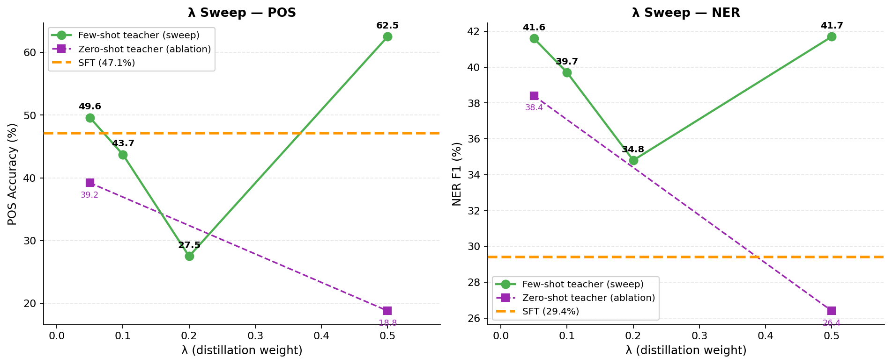

# Lambda Sweep Results

Testing λ ∈ {0.05, 0.10, 0.20} vs existing λ=0.50 (distilled) and SFT/Control baselines.
Single-task training: **all** conditions train on only the target task for 200 steps (batch=8).

All conditions share the same Llama-3.2-3B-Instruct base + LoRA (r=16) setup.

> **Conditions:** all single-task, 200 steps, batch=8, LoRA r=16.  
> **Few-shot teacher** = teacher sees 5-shot context (the ICL signal).  
> **Zero-shot teacher** = teacher sees same zero-shot input as student (null ICL signal, tests regularisation only).

## POS (Acc %)

| Condition | Train | λ | EN | HI | ES | DE | FR | ZH | Avg | Δ vs POS-SFT |
| :--- | :---: | :---: | :---: | :---: | :---: | :---: | :---: | :---: | :---: | :---: |
| **SFT** (CE only, λ=0) | few-shot N/A | 0 | 51.7 | 37.9 | 49.5 | 51.9 | 41.8 | 49.9 | **47.1** | +0.0 |
| Few-shot teacher λ=0.05 | few-shot | 0.05 | 57.6 | 40.9 | 53.9 | 52.1 | 51.2 | 41.8 | **49.6** | **+2.5** |
| Few-shot teacher λ=0.10 | few-shot | 0.10 | 46.6 | 33.6 | 46.9 | 49.9 | 41.0 | 44.2 | **43.7** | **-3.4** |
| Few-shot teacher λ=0.20 | few-shot | 0.20 | 29.0 | 25.9 | 27.2 | 28.0 | 25.5 | 29.7 | **27.5** | **-19.6** |
| Few-shot teacher λ=0.50 | few-shot | 0.50 | 18.5 | 23.7 | 21.4 | 18.6 | 21.9 | 23.2 | **21.2** | **-25.9** |
| Zero-shot teacher λ=0.05 *(ablation)* | zero-shot | 0.05 | 42.2 | 34.4 | 37.6 | 42.4 | 36.3 | 42.2 | **39.2** | **-7.9** |
| Zero-shot teacher λ=0.50 | zero-shot | 0.50 | 15.4 | 22.7 | 19.4 | 14.8 | 19.8 | 20.6 | **18.8** | **-28.3** |

## NER (F1 %)

| Condition | Train | λ | EN | HI | ES | DE | FR | ZH | Avg | Δ vs NER-SFT |
| :--- | :---: | :---: | :---: | :---: | :---: | :---: | :---: | :---: | :---: | :---: |
| **SFT** (CE only, λ=0) | few-shot N/A | 0 | 23.3 | 36.7 | 38.2 | 27.5 | 30.7 | 19.9 | **29.4** | +0.0 |
| Few-shot teacher λ=0.05 | few-shot | 0.05 | 36.9 | 52.8 | 50.7 | 40.0 | 43.0 | 26.0 | **41.6** | **+12.2** |
| Few-shot teacher λ=0.10 | few-shot | 0.10 | 35.3 | 51.1 | 47.0 | 37.1 | 42.4 | 25.5 | **39.7** | **+10.3** |
| Few-shot teacher λ=0.20 | few-shot | 0.20 | 28.9 | 46.3 | 36.6 | 36.7 | 38.8 | 21.5 | **34.8** | **+5.4** |
| Few-shot teacher λ=0.50 | few-shot | 0.50 | 30.6 | 41.0 | 47.9 | 31.2 | 38.2 | 24.4 | **35.5** | **+6.1** |
| Zero-shot teacher λ=0.05 *(ablation)* | zero-shot | 0.05 | 36.9 | 49.6 | 48.9 | 32.0 | 41.4 | 21.7 | **38.4** | **+9.0** |
| Zero-shot teacher λ=0.50 | zero-shot | 0.50 | 23.2 | 31.1 | 38.9 | 23.8 | 27.1 | 14.5 | **26.4** | **-3.0** |

## Interpretation

The sweep answers two questions:

1. **Is there any λ where distillation beats SFT on POS/NER?**  If yes, the teacher signal is valid but λ=0.5 is too aggressive — dynamic λ will reliably recover the gain.
2. **What is the optimal λ range per task?**  The λ at which Distilled − SFT turns positive is the lower bound for the per-task dynamic λ target.

Expected pattern based on our hypothesis:  `Acc(λ=0.05) > Acc(λ=0.10) > Acc(λ=0.20) > Acc(λ=0.50)` for POS/NER,  with at least λ=0.05 meeting or exceeding the SFT baseline.

If the ordering holds, it validates the dynamic-λ direction and provides the empirical target λ values for Strategy 5 (task-type prior).