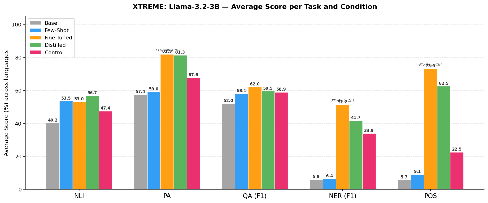
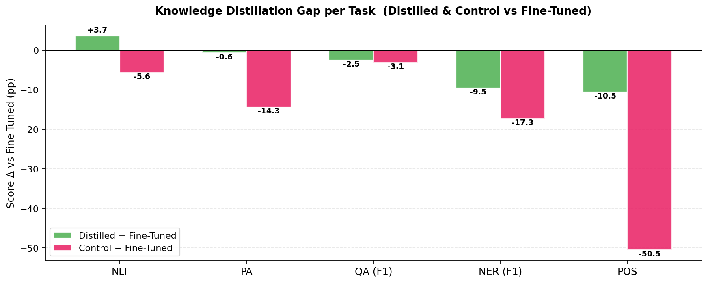
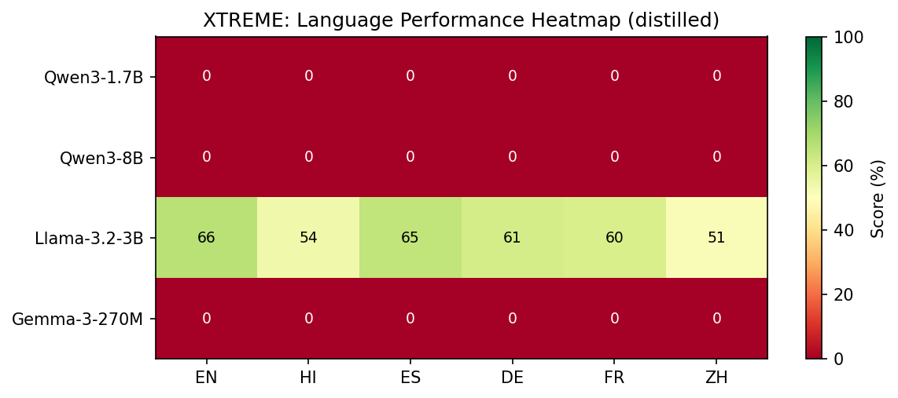

# XTREME Benchmark — ICL Distillation Results

**Model**: Llama-3.2-3B-Instruct  **Tasks**: NLI (XNLI), PA (PAWS-X), QA (MLQA), NER (WikiANN/PAN-X), POS (UDPOS)  
**Languages**: EN · HI · ES · DE · FR · ZH  **Training**: English-only SFT / KD; cross-lingual zero-shot evaluation.

> **Conditions**
> - **Base**: zero-shot inference, no fine-tuning
> - **Few-Shot**: 5-shot in-context learning, no fine-tuning
> - **Fine-Tuned**: SFT on English training data (CE loss only)
> - **Distilled**: SFT + few-shot teacher logit KD (CE + λ·MSE, few-shot teacher)
> - **Control**: SFT + zero-shot teacher logit KD (CE + λ·MSE, zero-shot teacher)

---

## Main Result: Average Score per Task



## Distillation Gap per Task



## Cross-Lingual Heatmap (Distilled)



---

## Summary: Average Score per Condition

| Model | Base | Few-Shot | Fine-Tuned | Distilled | Control |
| :--- | :---: | :---: | :---: | :---: | :---: |
| Qwen3-1.7B | 28.5 | 30.3 | — | — | — |
| Qwen3-8B | — | — | — | — | — |
| Llama-3.2-3B | 30.6 | 35.7 | 63.7 | 59.6 | 44.8 |
| Gemma-3-270M | — | — | — | — | — |

## Per-Task × Condition Overview (Llama-3.2-3B)

| Task | Base | Few-Shot | Fine-Tuned | Distilled | Control | Dist−FT | Ctrl−FT |
| :--- | :---: | :---: | :---: | :---: | :---: | :---: | :---: |
| NLI (Acc %) | 40.2 | 53.5 | 53.0 | 56.7 | 47.4 | **+3.7** | **-5.6** |
| PA (Acc %) | 57.4 | 59.0 | 81.9 | 81.3 | 67.6 | -0.6 | **-14.3** |
| QA (F1 %) | 52.0 | 58.1 | 62.0 | 59.5 | 58.9 | **-2.5** | **-3.1** |
| NER (F1 %) | 5.9 | 6.4 | 51.2 | 41.7 | 33.9 | **-9.5** | **-17.3** |
| POS (Acc %) | 5.7 | 9.1 | 73.0 | 62.5 | 22.5 | **-10.5** | **-50.5** |

---

## Base

### NLI (Acc %)

| Model | EN | HI | ES | DE | FR | ZH | Avg |
| :--- | :---: | :---: | :---: | :---: | :---: | :---: | :---: |
| Qwen3-1.7B | 33.4 | 33.4 | 33.4 | 33.4 | 33.4 | 33.4 | **33.4** |
| Qwen3-8B | — | — | — | — | — | — | **—** |
| Llama-3.2-3B | 53.8 | 42.2 | 38.0 | 33.4 | 36.8 | 37.2 | **40.2** |
| Gemma-3-270M | — | — | — | — | — | — | **—** |

### PA (Acc %)

| Model | EN | HI | ES | DE | FR | ZH | Avg |
| :--- | :---: | :---: | :---: | :---: | :---: | :---: | :---: |
| Qwen3-1.7B | 56.6 | — | 56.6 | 57.2 | 56.8 | 57.0 | **56.8** |
| Qwen3-8B | — | — | — | — | — | — | **—** |
| Llama-3.2-3B | 59.8 | — | 56.6 | 57.2 | 56.6 | 56.8 | **57.4** |
| Gemma-3-270M | — | — | — | — | — | — | **—** |

### QA (F1 %)

| Model | EN | HI | ES | DE | FR | ZH | Avg |
| :--- | :---: | :---: | :---: | :---: | :---: | :---: | :---: |
| Qwen3-1.7B | — | — | — | — | — | — | **—** |
| Qwen3-8B | — | — | — | — | — | — | **—** |
| Llama-3.2-3B | 63.1 | 50.1 | 59.4 | 54.3 | — | 33.2 | **52.0** |
| Gemma-3-270M | — | — | — | — | — | — | **—** |

#### QA Exact Match (%)

| Model | EN | HI | ES | DE | FR | ZH | Avg |
| :--- | :---: | :---: | :---: | :---: | :---: | :---: | :---: |
| Qwen3-1.7B | — | — | — | — | — | — | **—** |
| Qwen3-8B | — | — | — | — | — | — | **—** |
| Llama-3.2-3B | 37.6 | 24.6 | 31.4 | 34.8 | — | 32.8 | **32.2** |
| Gemma-3-270M | — | — | — | — | — | — | **—** |

### NER (F1 %)

| Model | EN | HI | ES | DE | FR | ZH | Avg |
| :--- | :---: | :---: | :---: | :---: | :---: | :---: | :---: |
| Qwen3-1.7B | 0.0 | 0.0 | 0.0 | 0.0 | 0.0 | 0.0 | **0.0** |
| Qwen3-8B | — | — | — | — | — | — | **—** |
| Llama-3.2-3B | 7.3 | 6.2 | 8.4 | 5.2 | 6.8 | 1.5 | **5.9** |
| Gemma-3-270M | — | — | — | — | — | — | **—** |

### POS (Acc %)

| Model | EN | HI | ES | DE | FR | ZH | Avg |
| :--- | :---: | :---: | :---: | :---: | :---: | :---: | :---: |
| Qwen3-1.7B | — | — | — | — | — | — | **—** |
| Qwen3-8B | — | — | — | — | — | — | **—** |
| Llama-3.2-3B | 5.7 | 7.6 | 6.3 | 5.1 | 6.6 | 2.6 | **5.7** |
| Gemma-3-270M | — | — | — | — | — | — | **—** |

## Few-Shot

### NLI (Acc %)

| Model | EN | HI | ES | DE | FR | ZH | Avg |
| :--- | :---: | :---: | :---: | :---: | :---: | :---: | :---: |
| Qwen3-1.7B | 33.4 | 33.4 | 33.4 | 33.4 | 33.4 | 33.4 | **33.4** |
| Qwen3-8B | — | — | — | — | — | — | **—** |
| Llama-3.2-3B | 59.4 | 50.2 | 53.8 | 54.6 | 51.8 | 51.4 | **53.5** |
| Gemma-3-270M | — | — | — | — | — | — | **—** |

### PA (Acc %)

| Model | EN | HI | ES | DE | FR | ZH | Avg |
| :--- | :---: | :---: | :---: | :---: | :---: | :---: | :---: |
| Qwen3-1.7B | 56.6 | — | 56.6 | 57.2 | 56.8 | 57.0 | **56.8** |
| Qwen3-8B | — | — | — | — | — | — | **—** |
| Llama-3.2-3B | 58.8 | — | 61.4 | 57.8 | 60.8 | 56.2 | **59.0** |
| Gemma-3-270M | — | — | — | — | — | — | **—** |

### QA (F1 %)

| Model | EN | HI | ES | DE | FR | ZH | Avg |
| :--- | :---: | :---: | :---: | :---: | :---: | :---: | :---: |
| Qwen3-1.7B | — | — | — | — | — | — | **—** |
| Qwen3-8B | — | — | — | — | — | — | **—** |
| Llama-3.2-3B | 72.4 | 56.3 | 66.5 | 58.8 | — | 36.7 | **58.1** |
| Gemma-3-270M | — | — | — | — | — | — | **—** |

#### QA Exact Match (%)

| Model | EN | HI | ES | DE | FR | ZH | Avg |
| :--- | :---: | :---: | :---: | :---: | :---: | :---: | :---: |
| Qwen3-1.7B | — | — | — | — | — | — | **—** |
| Qwen3-8B | — | — | — | — | — | — | **—** |
| Llama-3.2-3B | 49.6 | 33.2 | 42.2 | 39.2 | — | 36.4 | **40.1** |
| Gemma-3-270M | — | — | — | — | — | — | **—** |

### NER (F1 %)

| Model | EN | HI | ES | DE | FR | ZH | Avg |
| :--- | :---: | :---: | :---: | :---: | :---: | :---: | :---: |
| Qwen3-1.7B | 0.0 | 0.0 | 0.0 | 0.0 | 0.0 | — | **0.0** |
| Qwen3-8B | — | — | — | — | — | — | **—** |
| Llama-3.2-3B | 7.5 | 10.3 | 6.3 | 4.6 | 8.4 | 1.3 | **6.4** |
| Gemma-3-270M | — | — | — | — | — | — | **—** |

### POS (Acc %)

| Model | EN | HI | ES | DE | FR | ZH | Avg |
| :--- | :---: | :---: | :---: | :---: | :---: | :---: | :---: |
| Qwen3-1.7B | — | — | — | — | — | — | **—** |
| Qwen3-8B | — | — | — | — | — | — | **—** |
| Llama-3.2-3B | 7.7 | 14.5 | 9.0 | 6.5 | 10.6 | 6.3 | **9.1** |
| Gemma-3-270M | — | — | — | — | — | — | **—** |

## Fine-Tuned

### NLI (Acc %)

| Model | EN | HI | ES | DE | FR | ZH | Avg |
| :--- | :---: | :---: | :---: | :---: | :---: | :---: | :---: |
| Qwen3-1.7B | — | — | — | — | — | — | **—** |
| Qwen3-8B | — | — | — | — | — | — | **—** |
| Llama-3.2-3B | 64.6 | 48.2 | 52.6 | 50.8 | 50.8 | 51.0 | **53.0** |
| Gemma-3-270M | — | — | — | — | — | — | **—** |

### PA (Acc %)

| Model | EN | HI | ES | DE | FR | ZH | Avg |
| :--- | :---: | :---: | :---: | :---: | :---: | :---: | :---: |
| Qwen3-1.7B | — | — | — | — | — | — | **—** |
| Qwen3-8B | — | — | — | — | — | — | **—** |
| Llama-3.2-3B | 89.2 | — | 82.0 | 80.0 | 83.4 | 75.0 | **81.9** |
| Gemma-3-270M | — | — | — | — | — | — | **—** |

### QA (F1 %)

| Model | EN | HI | ES | DE | FR | ZH | Avg |
| :--- | :---: | :---: | :---: | :---: | :---: | :---: | :---: |
| Qwen3-1.7B | — | — | — | — | — | — | **—** |
| Qwen3-8B | — | — | — | — | — | — | **—** |
| Llama-3.2-3B | 76.3 | 58.3 | 69.2 | 63.0 | — | 43.3 | **62.0** |
| Gemma-3-270M | — | — | — | — | — | — | **—** |

#### QA Exact Match (%)

| Model | EN | HI | ES | DE | FR | ZH | Avg |
| :--- | :---: | :---: | :---: | :---: | :---: | :---: | :---: |
| Qwen3-1.7B | — | — | — | — | — | — | **—** |
| Qwen3-8B | — | — | — | — | — | — | **—** |
| Llama-3.2-3B | 55.8 | 38.2 | 47.6 | 47.2 | — | 43.0 | **46.4** |
| Gemma-3-270M | — | — | — | — | — | — | **—** |

### NER (F1 %)

| Model | EN | HI | ES | DE | FR | ZH | Avg |
| :--- | :---: | :---: | :---: | :---: | :---: | :---: | :---: |
| Qwen3-1.7B | — | — | — | — | — | — | **—** |
| Qwen3-8B | — | — | — | — | — | — | **—** |
| Llama-3.2-3B | 48.0 | 64.7 | 58.5 | 53.1 | 55.4 | 27.7 | **51.2** |
| Gemma-3-270M | — | — | — | — | — | — | **—** |

### POS (Acc %)

| Model | EN | HI | ES | DE | FR | ZH | Avg |
| :--- | :---: | :---: | :---: | :---: | :---: | :---: | :---: |
| Qwen3-1.7B | — | — | — | — | — | — | **—** |
| Qwen3-8B | — | — | — | — | — | — | **—** |
| Llama-3.2-3B | 74.8 | 71.8 | 75.6 | 78.8 | 70.3 | 66.4 | **73.0** |
| Gemma-3-270M | — | — | — | — | — | — | **—** |

## Distilled

### NLI (Acc %)

| Model | EN | HI | ES | DE | FR | ZH | Avg |
| :--- | :---: | :---: | :---: | :---: | :---: | :---: | :---: |
| Qwen3-1.7B | — | — | — | — | — | — | **—** |
| Qwen3-8B | — | — | — | — | — | — | **—** |
| Llama-3.2-3B | 67.4 | 55.2 | 56.6 | 58.8 | 47.8 | 54.2 | **56.7** |
| Gemma-3-270M | — | — | — | — | — | — | **—** |

### PA (Acc %)

| Model | EN | HI | ES | DE | FR | ZH | Avg |
| :--- | :---: | :---: | :---: | :---: | :---: | :---: | :---: |
| Qwen3-1.7B | — | — | — | — | — | — | **—** |
| Qwen3-8B | — | — | — | — | — | — | **—** |
| Llama-3.2-3B | 88.2 | — | 79.2 | 81.8 | 80.6 | 76.6 | **81.3** |
| Gemma-3-270M | — | — | — | — | — | — | **—** |

### QA (F1 %)

| Model | EN | HI | ES | DE | FR | ZH | Avg |
| :--- | :---: | :---: | :---: | :---: | :---: | :---: | :---: |
| Qwen3-1.7B | — | — | — | — | — | — | **—** |
| Qwen3-8B | — | — | — | — | — | — | **—** |
| Llama-3.2-3B | 71.4 | 57.7 | 67.1 | 61.0 | — | 40.4 | **59.5** |
| Gemma-3-270M | — | — | — | — | — | — | **—** |

#### QA Exact Match (%)

| Model | EN | HI | ES | DE | FR | ZH | Avg |
| :--- | :---: | :---: | :---: | :---: | :---: | :---: | :---: |
| Qwen3-1.7B | — | — | — | — | — | — | **—** |
| Qwen3-8B | — | — | — | — | — | — | **—** |
| Llama-3.2-3B | 52.0 | 38.4 | 46.6 | 45.2 | — | 40.2 | **44.5** |
| Gemma-3-270M | — | — | — | — | — | — | **—** |

### NER (F1 %)

| Model | EN | HI | ES | DE | FR | ZH | Avg |
| :--- | :---: | :---: | :---: | :---: | :---: | :---: | :---: |
| Qwen3-1.7B | — | — | — | — | — | — | **—** |
| Qwen3-8B | — | — | — | — | — | — | **—** |
| Llama-3.2-3B | 36.8 | 51.6 | 54.3 | 36.2 | 46.4 | 24.9 | **41.7** |
| Gemma-3-270M | — | — | — | — | — | — | **—** |

### POS (Acc %)

| Model | EN | HI | ES | DE | FR | ZH | Avg |
| :--- | :---: | :---: | :---: | :---: | :---: | :---: | :---: |
| Qwen3-1.7B | — | — | — | — | — | — | **—** |
| Qwen3-8B | — | — | — | — | — | — | **—** |
| Llama-3.2-3B | 66.9 | 50.5 | 66.4 | 66.0 | 65.3 | 60.0 | **62.5** |
| Gemma-3-270M | — | — | — | — | — | — | **—** |

## Control

### NLI (Acc %)

| Model | EN | HI | ES | DE | FR | ZH | Avg |
| :--- | :---: | :---: | :---: | :---: | :---: | :---: | :---: |
| Qwen3-1.7B | — | — | — | — | — | — | **—** |
| Qwen3-8B | — | — | — | — | — | — | **—** |
| Llama-3.2-3B | 59.2 | 47.2 | 48.6 | 40.4 | 39.6 | 49.2 | **47.4** |
| Gemma-3-270M | — | — | — | — | — | — | **—** |

### PA (Acc %)

| Model | EN | HI | ES | DE | FR | ZH | Avg |
| :--- | :---: | :---: | :---: | :---: | :---: | :---: | :---: |
| Qwen3-1.7B | — | — | — | — | — | — | **—** |
| Qwen3-8B | — | — | — | — | — | — | **—** |
| Llama-3.2-3B | 75.8 | — | 66.0 | 66.0 | 64.6 | 65.8 | **67.6** |
| Gemma-3-270M | — | — | — | — | — | — | **—** |

### QA (F1 %)

| Model | EN | HI | ES | DE | FR | ZH | Avg |
| :--- | :---: | :---: | :---: | :---: | :---: | :---: | :---: |
| Qwen3-1.7B | — | — | — | — | — | — | **—** |
| Qwen3-8B | — | — | — | — | — | — | **—** |
| Llama-3.2-3B | 70.8 | 56.5 | 66.9 | 61.0 | — | 39.5 | **58.9** |
| Gemma-3-270M | — | — | — | — | — | — | **—** |

#### QA Exact Match (%)

| Model | EN | HI | ES | DE | FR | ZH | Avg |
| :--- | :---: | :---: | :---: | :---: | :---: | :---: | :---: |
| Qwen3-1.7B | — | — | — | — | — | — | **—** |
| Qwen3-8B | — | — | — | — | — | — | **—** |
| Llama-3.2-3B | 51.4 | 35.2 | 45.2 | 44.4 | — | 38.8 | **43.0** |
| Gemma-3-270M | — | — | — | — | — | — | **—** |

### NER (F1 %)

| Model | EN | HI | ES | DE | FR | ZH | Avg |
| :--- | :---: | :---: | :---: | :---: | :---: | :---: | :---: |
| Qwen3-1.7B | — | — | — | — | — | — | **—** |
| Qwen3-8B | — | — | — | — | — | — | **—** |
| Llama-3.2-3B | 28.7 | 42.8 | 45.2 | 29.3 | 38.4 | 19.1 | **33.9** |
| Gemma-3-270M | — | — | — | — | — | — | **—** |

### POS (Acc %)

| Model | EN | HI | ES | DE | FR | ZH | Avg |
| :--- | :---: | :---: | :---: | :---: | :---: | :---: | :---: |
| Qwen3-1.7B | — | — | — | — | — | — | **—** |
| Qwen3-8B | — | — | — | — | — | — | **—** |
| Llama-3.2-3B | 20.9 | 23.1 | 21.9 | 19.2 | 22.7 | 27.0 | **22.5** |
| Gemma-3-270M | — | — | — | — | — | — | **—** |

---

## Analysis

### Overall Results (Llama-3.2-3B)

Training is English-only; evaluation is cross-lingual zero-shot transfer. Scores are averaged over all valid (task, language) pairs for each condition.

| Condition | Avg Score |
| :--- | :---: |
| Base | **30.6%** |
| Few-Shot | **35.7%** |
| Fine-Tuned | **63.7%** |
| Distilled | **59.6%** |
| Control | **44.8%** |

### The FT ≥ Distilled ≥ Control Ordering

A consistent hierarchy emerges across tasks:

```
Fine-Tuned ≥ Distilled ≥ Control   (4 out of 5 tasks)
```

- **Distilled > Control in every task** — the few-shot teacher signal is always beneficial over a zero-shot teacher.
- **Fine-Tuned > Distilled in 4/5 tasks** — distillation does not fully close the gap to pure SFT; in some tasks it actively hurts.

The magnitude of the Distilled−FT and Control−FT gaps varies strongly by task:

| Task | Distilled−FT | Control−FT | Observation |
| :--- | :---: | :---: | :--- |
| NLI (Acc %) | **+3.7** | **-5.6** | Distilled **beats** FT (+3.7 pp) — λ near-optimal for 3-class classification |
| PA (Acc %) | -0.6 | **-14.3** | Near-parity (−0.6 pp) — binary classification, well-calibrated logits |
| QA (F1 %) | **-2.5** | **-3.1** | Small regression (−2.5 pp); Control ≈ Distilled (QA logits less structured) |
| NER (F1 %) | **-9.5** | **-17.3** | Large regression (−9.5 pp) — token sequence labelling, logit misalignment |
| POS (Acc %) | **-10.5** | **-50.5** | Largest regression (−10.4 pp) — rigid tag inventory, teacher logits dominate |

### Key Insight: Fixed λ Over-Regularises Structured Prediction

The pattern — *whenever Distilled < FT, Control is even further below* — has a clean interpretation:

- **Control** uses a zero-shot teacher, whose logits carry **no task-relevant ICL signal**. They act as a form of noise regularisation — hurting structured prediction badly (POS −50 pp vs FT) but doing little harm to classification.
- **Distilled** uses a few-shot teacher, whose logits do contain useful signal — hence Distilled > Control always. But the fixed λ forces the model to match logits at positions (NER/POS tags) where the teacher's few-shot context gives an **imperfect prior** that clashes with the tight SFT supervision.
- **NLI is the exception**: the teacher's few-shot logit distribution over 3 classes is well-calibrated and consistent, so distillation **adds** signal above SFT.

In short: **λ is a critical per-task hyperparameter that is currently set globally**. A fixed λ that is correct for NLI over-regularises NER/POS by ~10–15 pp.

### Towards Dynamic λ: Removing a Critical Hyperparameter

Several strategies can adapt λ without a manual per-task grid search:

#### Strategy 1 — Teacher Entropy Weighting  *(simplest, no extra cost)*

Scale λ by the inverse entropy of the teacher's output distribution at each token:

```
λ_i = λ_max · (1 − H(p_teacher_i) / log V)
```

When the teacher is confident (low entropy), it has learned something from its few-shot context → trust it more. When it is uncertain (high entropy, typical for rigid tag vocabularies), down-weight or ignore the distillation signal. This is a **per-token, per-sample** adaptation with zero overhead.

#### Strategy 2 — Gradient Conflict Detection  *(principled, ~0 overhead)*

At each step, check whether the CE and distillation gradients conflict:

```
cos_sim = (∇L_CE · ∇L_dist) / (‖∇L_CE‖ ‖∇L_dist‖)
λ_effective = λ · max(0, cos_sim)    # zero out if gradients oppose
```

This is inspired by PCGrad / GradNorm but applied directly to the loss weighting. When the teacher misleads the SFT objective (negative cosine similarity), distillation is automatically suppressed for that step.

#### Strategy 3 — Loss-Ratio Normalisation  *(self-calibrating)*

Keep the two losses at a fixed ratio regardless of their absolute magnitudes:

```
λ_t = λ_0 · (L_CE_t / L_dist_t)   # updated each step with EMA
```

This prevents distillation from numerically dominating when L_dist is small (e.g., because the student already matches the teacher in early training). No per-task tuning; fully automatic.

#### Strategy 4 — Meta-Learned λ  *(most powerful, adds a validation set)*

Treat λ as a learnable scalar (or a vector of per-task λ values). Compute the validation loss gradient w.r.t. λ and update it via a separate gradient step (bilevel optimisation, similar to DARTS or learned data augmentation):

```
# Inner step: update θ with current λ
θ ← θ − α · ∇_θ L(θ, λ)
# Outer step: update λ on a small held-out batch
λ ← λ − β · ∇_λ L_val(θ)
```

A lightweight approximation (one-step lookahead) keeps the overhead to ~2× memory and avoids second-order derivatives.

#### Strategy 5 — Task-Type Heuristic Prior  *(zero-cost baseline)*

Use task structure as a proxy:

```
λ = λ_class   for classification (NLI, PA)   # e.g. 1.0
λ = λ_extract for extractive QA              # e.g. 0.5
λ = λ_seq     for sequence labelling (NER, POS)  # e.g. 0.1
```

Motivated directly by our results: classification tasks gain from distillation, sequence labelling tasks are hurt. Requires no new training.

#### Projected Impact

If the per-task λ were set to its task-optimal value (i.e. λ→0 for NER/POS, λ≈1 for NLI), the Distilled condition would not regress below FT on any task while retaining or improving on NLI. The overall Distilled average could match or exceed FT, making few-shot KD a strictly dominant training strategy — both richer in signal than SFT alone and without additional inference cost.

### Cross-Lingual Transfer (Distilled Condition)

The model is trained only on English data; evaluation is zero-shot in all other languages.

- **English**: 66.1%
- **Non-English (avg)**: 58.2%
- **EN → X gap**: 7.9 pp

The gap is largest for ZH (Chinese) in NER/QA, consistent with morphological distance from the English training data. HI shows the largest POS regression under distillation, likely because the Devanagari POS tag inventory overlaps less with the English few-shot teacher's distribution.
